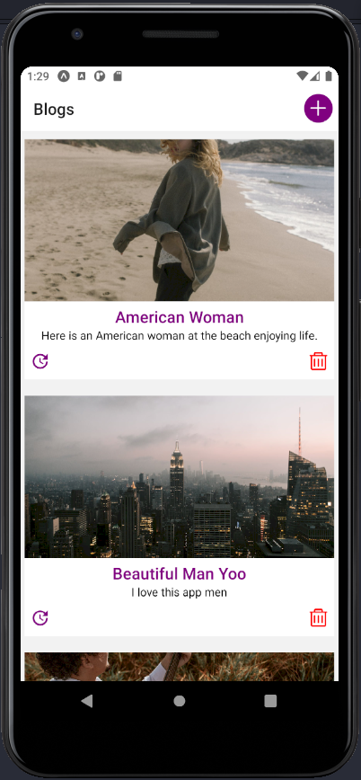
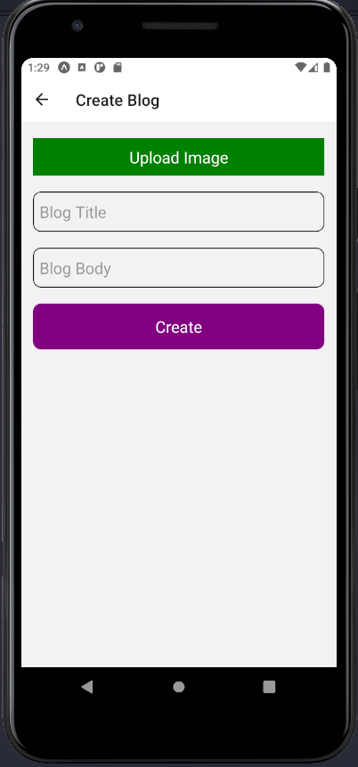
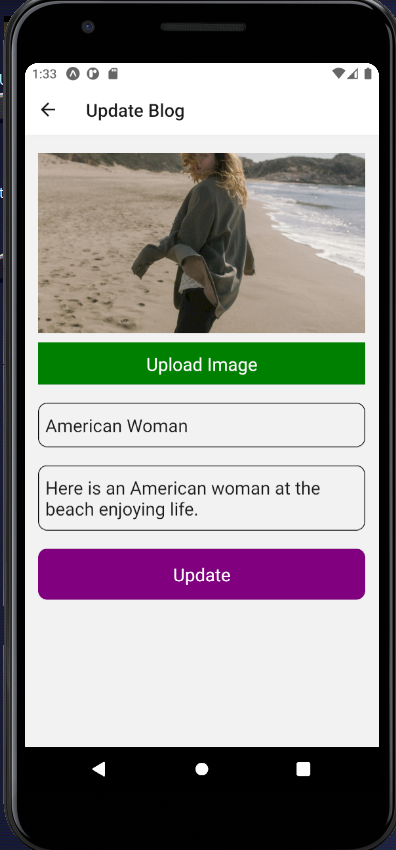

#### React Native Blog App with Nodejs server and Typescript

This is a mini blogging mobile application built with React Native, Express and MySQL.

[Click here to download the database file.](./blog.sql)

##### 1. Blogs Screen

This screen shows all the blog posts from the database.

##### 2. Create Screen

This screen is used to create a blog post. The create form takes as inputs: the title, description and the image.

##### 3. Update Screen

This screen is used to update a blog post.

 - To create a blog post, click on the `plus icon` on the `blogs screen` header.
 - To delete a blog post, click on the `delete icon` on the desired blog post.
 - To update a blog post, click on the `update icon` on the desired blog post.
